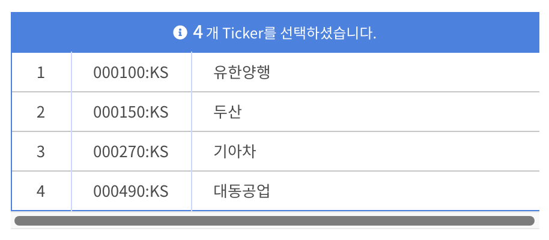
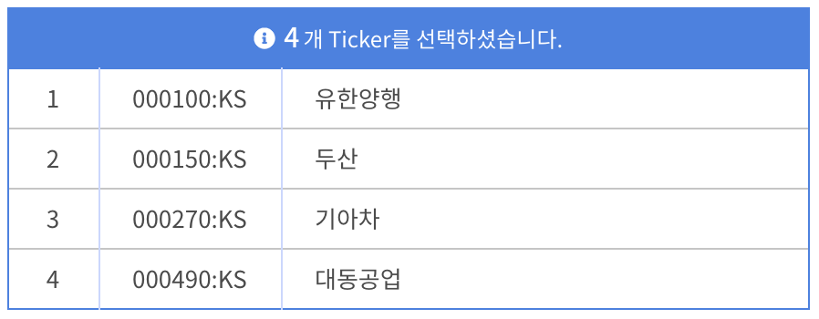

# table 요소의 head 행을 잘 숨기는 법

### 문제 상황

table의 head 행을 숨겨야 해서 `table th` 형식의 선택자에 `display: none` 속성을 적용하였다.

그랬더니 아래와 같이 가로 스크롤이 생겼음

### 해결 방법

`table th` 대신 `table thead` 형식의 선택자에 `display: none` 속성을 적용하였다.

그랬더니 가로 스크롤 없이 정상적으로 표시가 되었다.

